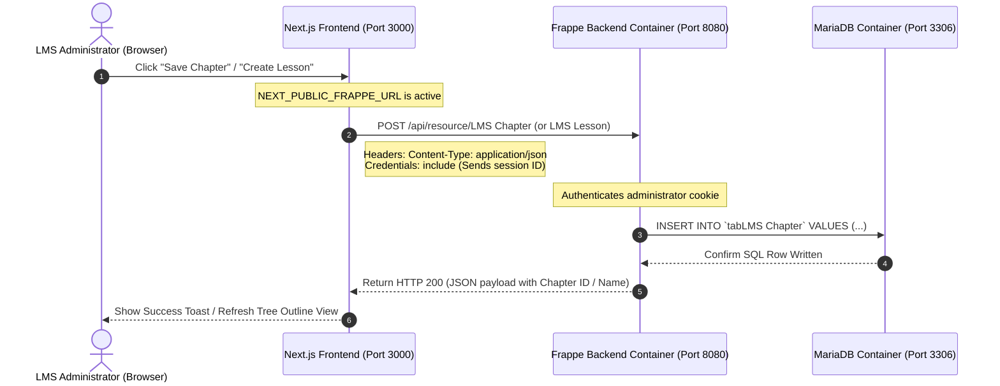
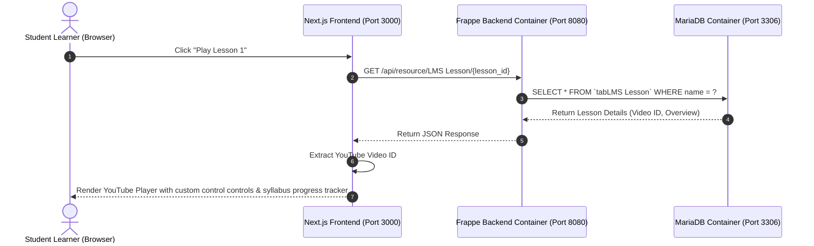
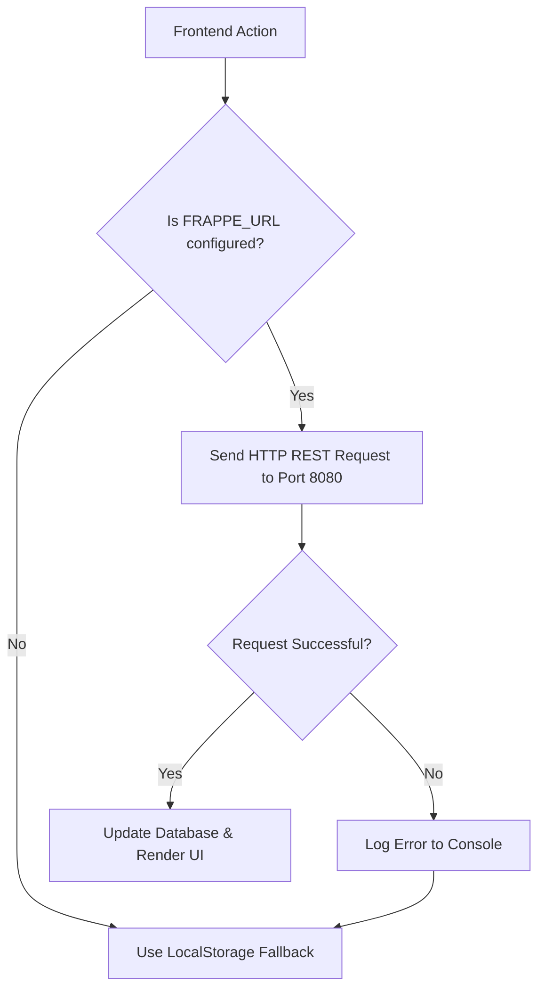

# Next.js & Headless Frappe LMS Data Flow & Architecture Guide

This guide details how data travels, how ports are mapped, and the overall runtime workflow when the headless Frappe LMS backend is active.

---

## 1. System Architecture & Container Design

When you run `docker compose up -d`, Docker starts three containers connected via an internal network. The Next.js frontend, running directly on your Windows host machine, connects to the exposed ports of these containers.

```mermaid
graph TD
    %% Host System
    subgraph Host ["Windows Host OS"]
        Browser["Web Browser (User / Admin)"]
        NextJS["Next.js App Server (Port 3000)"]
    end

    %% Docker Environment
    subgraph Docker ["Docker Engine (Container Network)"]
        %% Frappe Backend Container
        subgraph FrappeService ["Frappe App Service"]
            BenchServer["Frappe Bench Server (Port 8000)"]
            SocketIOServer["Socket.io Server (Port 9000)"]
            AppCode["LMS & Payments Apps"]
        end

        %% Database Container
        subgraph DatabaseService ["MariaDB Service"]
            MariaDB["MariaDB Database Engine (Port 3306)"]
        end

        %% Cache Container
        subgraph CacheService ["Redis Service"]
            Redis["Redis Cache Engine (Port 6379)"]
        end
    end

    %% User Interaction
    Browser -->|HTTP Requests| NextJS
    Browser -->|Admin / Student REST Queries| BenchServer

    %% Port Forwarding Maps
    NextJS -->|API Proxy Calls (Port 8080)| BenchServer
    
    %% Host mappings to Container Ports
    %% Host Port : Container Port
    NextJS -.->|Port Mapping 8080:8000| BenchServer
    NextJS -.->|Port Mapping 9000:9000| SocketIOServer

    %% Container to Container Internal Connections
    BenchServer -->|SQL Queries (Internal 3306)| MariaDB
    BenchServer -->|In-Memory Cache (Internal 6379)| Redis
```

---

## 2. Step-by-Step Data Flow Workflows

### Workflow A: Administrator Creates a Course Syllabus
When you click **"Sync with Frappe"** or save a new chapter/lesson in the course outline editor on the Admin side:



### Workflow B: Student Views a Course Lesson
When a student logs in to watch a lesson:



---

## 3. Communication Protocols & Security

| Protocol / Layer | Source | Destination | Purpose |
| :--- | :--- | :--- | :--- |
| **REST over HTTPS/HTTP** | Next.js Server / Browser | Frappe Backend (`http://localhost:8080`) | CRUD operations for Courses, Chapters, Lessons, Quizzes, and Enrollments. |
| **Session Cookies (CORS)** | Browser Client | Frappe Backend (`http://localhost:8080`) | Next.js requests send `credentials: "include"`. Frappe matches the session cookie to authorize actions. |
| **Database Connector** | Frappe Container | MariaDB Container (`mariadb:3306`) | Bench uses internal Docker DNS to execute SQL queries. |
| **Caching Engine** | Frappe Container | Redis Container (`redis:6379`) | Bench caches session IDs, site configs, and background jobs to reduce MariaDB query load. |

---

## 4. Resilience: Auto-Switching Mechanism

When a user interacts with the app, `lib/frappe.js` manages connection errors dynamically:


