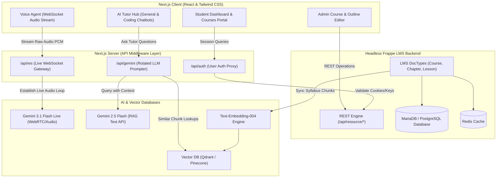
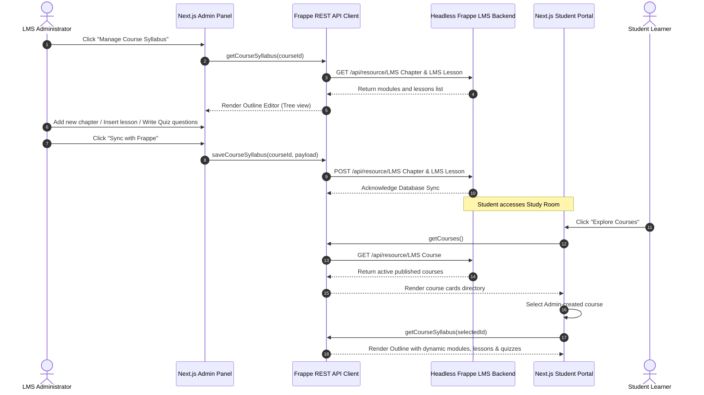
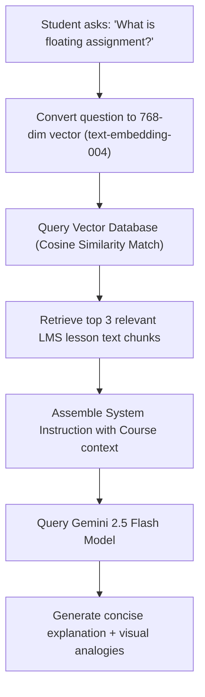

# Project Integration Documentation: Next.js & Headless Frappe LMS

This document provides a comprehensive technical overview of the integrations, UI features, REST API structures, and AI agents implemented in the **LMS AI Platform**. It serves as an architectural blueprint for connecting the Next.js frontend with the headless Frappe LMS backend.

---

## 1. System Architecture

The application is built on a **decoupled headless architecture**. The Next.js frontend acts as the user interface and coordinates low-latency AI sessions, while the Frappe framework manages user sessions, enrollments, and syllabus data.

### 1.1 Decoupled Architecture Blueprint



---

## 2. Admin-to-Student Data Flow & Synchronization

The Next.js UI mirrors the data structure of Frappe LMS. This allows courses, modules (chapters), lessons, and quiz questions created by the administrator to appear instantly in the student portal.

### 2.1 Course Syllabus Sync Loop



---

## 3. Headless Frappe LMS API Specifications

Frappe provides REST endpoints for resources automatically. The frontend communicates with these endpoints using `lib/frappe.js`.

### 3.1 Authentication Schemes
- **Cookie Session:** Next.js proxies user login credentials to `/api/method/login` and receives session ID cookies (`sid`), which are passed in subsequent requests using `credentials: "include"`.
- **API Token Headers:** Server-to-server middleware calls use custom auth headers: `Authorization: token {api_key}:{api_secret}`.

### 3.2 DocType Resource Mappings

| Frontend Component | Frappe DocType | Method / Resource Endpoint | Operation |
| :--- | :--- | :--- | :--- |
| **Admin Panel Course Table** | `LMS Course` | `/api/resource/LMS Course` | `GET`, `POST` |
| **Admin Panel Course Card** | `LMS Course` | `/api/resource/LMS Course/<name>` | `PUT`, `DELETE` |
| **Syllabus Module Row** | `LMS Chapter` | `/api/resource/LMS Chapter` | `GET` (filtered by course), `POST`, `DELETE` |
| **Lesson Detail Viewer** | `LMS Lesson` | `/api/resource/LMS Lesson` | `GET` (filtered by chapter), `POST`, `DELETE` |
| **Course Enrollment** | `LMS Course Enrollment`| `/api/resource/LMS Course Enrollment` | `GET` (check active student enrollments) |

---

## 4. AI Tutor Mechanics: LLM, LangChain, RAG, & Memory

The tutor chatbots use advanced prompt-engineering, retrieval-augmentation, and memory sliding-windows to act as intelligent tutors.

### 4.1 Retrieval-Augmented Generation (RAG) Flow



### 4.2 Conversation Memory Strategy
To maintain context across chat sessions:
- **Short-Term Thread Cache:** Managed via Redis sliding-window cache, maintaining the last 15 messages of active sessions to retain prompt context.
- **Long-Term persistent metadata:** Important student performance summaries are written back to database profile metadata (e.g., "Student struggles with list slice operations, understands syntax definitions"). These profiles are fetched at the start of new tutoring sessions to customize explaining depths dynamically.

### 4.3 Voice Agent Audio WebSocket Loop
For the Voice Agent chatbot:
- **Low-Latency Connection:** Establish a bidirectional WebSocket connection on Next.js `/api/ws`.
- **Real-time Streaming:** Raw PCM audio captured from the microphone is packaged as base64 JSON frames and piped into **Gemini 3.1 Flash Live Preview** session.
- **Sentiment Adjustments:** A sentiment parser scans the translated student audio transcripts. When it detects frustration or confusion keywords, it automatically updates the system instruction to speak slower, simplify language, and introduce physical analogies.

---

## 5. Local Setup & Verification Steps

### 5.1 Step 1: Start the Headless Frappe LMS Backend
Ensure Docker Desktop is active on your Windows machine, open a terminal in the `frappe-learning` directory, and run:
```bash
cd C:\Users\seshu\frappe-learning
docker-compose up -d
```
*Note: This command pulls container services and runs `/workspace/init.sh` to initialize the lms.localhost site, install the LMS framework, and bind HTTP ports.*

### 5.2 Step 2: Configure Frontend Environment Variables
Navigate to your `demo-lms` directory and ensure your `.env` contains the backend target port:
```bash
FRAPPE_URL="http://localhost:8000"
```

### 5.3 Step 3: Run the Next.js Dev Server
Install node packages and spin up the development environment:
```bash
cd C:\Users\seshu\demo-lms
npm install
npm run dev
```
Open `http://localhost:3000` in your browser. Any change made in the Admin panel will now write directly to your database container and update the Student space dynamically.
