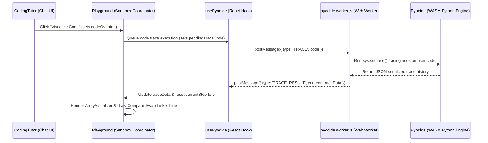

# Python Code Visualizer - Architecture & Implementation Documentation

This document explains the architecture, design, and code mechanics behind the interactive Python Code Visualizer built into the **Code with AI Tutor** workspace.

---

## 1. System Overview & Architecture

The visualization system compiles and executes Python code inside the user's browser using WebAssembly (**Pyodide**) running in a background Web Worker, captures a step-by-step local variables execution trace, and renders it using React and Framer Motion.

---

## 2. Key Modules & Implementation Details

### A. Background Execution & Trace Capture (`pyodide.worker.js`)
To trace variables at every line without blocking the main browser thread, execution is offloaded to a background worker.
- **Worker Initialization:** Downloads the official Pyodide WASM build from the jsDelivr CDN and initializes the environment.
- **Python Tracing Hook:** Uses Python's `sys.settrace()` capability to run a custom tracer function. On each `line` or `return` event, it:
  1. Inspects the active stack frame's local variables (`frame.f_locals`).
  2. Filters out system/internal helper variables.
  3. Serializes variables recursively to prevent circular references (with sets, lists, dicts, and floating-point `NaN`/`Inf` checks).
  4. Records the current execution step, line number, variables scope, and event type.
  5. Safeguards against infinite loops by terminating tracing if it exceeds 500 steps.

---

### B. React Hook Interface (`usePyodide.js`)
Manages communication with the Web Worker.
- Spawns and controls the worker instance life cycle.
- Listens to incoming worker messages and dispatches React callback actions:
  - `READY`: Pyodide has successfully loaded.
  - `STDOUT`/`STDERR`: Pipes prints and errors directly into the xterm.js terminal instance.
  - `TRACE_RESULT`: Sends the compiled execution trace array back to the Playground component.
- Supports emergency termination (`stopCode`) by terminating the worker and launching a fresh instance to avoid memory corruption.

---

### C. State Coordination (`Playground.jsx`)
Coordinates the visualizer UI, the code editor, and the trace player states.
- **State Fields:**
  - `code`: The current string contents of the CodeMirror editor.
  - `activeTab`: Currently active pane (`'console' | 'visualizer' | 'explanation'`).
  - `traceData`: The step-by-step frame array returned from Pyodide.
  - `currentStep`: The active step index being inspected.
  - `isPlaying`: Autoplay status boolean.
  - `playSpeed`: Play interval timer speed (`1500ms`, `1000ms`, or `500ms`).
  - `pendingTraceCode`: A state queue that buffers trace requests until Pyodide is fully `READY`.
- **Decoupled Synchronization:** 
  - To prevent infinite loops caused by tracking tracing states inside code overrides, parent `codeOverride` props are received and immediately converted into `pendingTraceCode` states. 
  - A separate runner effect consumes `pendingTraceCode` only when `isReady` is true and `isRunning` is false, executing the trace cleanly.

---

## 3. Key Animation & UI Features

### A. Timeline Scrubber & Speed Controls
- **Scrubber Slider:** An `<input type="range" />` slider tracks `currentStep` with a range of `[0, traceData.length - 1]`. Dragging the handle cancels autoplay (`isPlaying = false`) and updates the active step instantly, giving the user complete manual scrubbing control.
- **Play Speed Selector:** Let's the user cycle the playback speed between `1.0x` (1.5s interval), `1.5x` (1.0s interval), and `2.0x` (0.5s interval). The interval duration dynamically triggers the autoplay timer `useEffect`.

---

### B. Array & Sorting Network Visualizer (`renderArrayVisualizer`)
This is the core rendering canvas that displays lists as interactive animated cells, index pointers, and compare-swap connectors.
- **Dynamic Pointer Extraction:** Inspects all local scope variables for integers within list bounds (e.g. `i = 2, p = 3`) and maps them to index coordinates.
- **Operation Classification:** Computes the step action type on the fly:
  - **SWAP:** If the array order has changed compared to the previous step.
  - **COMPARE:** If two or more index pointers are active but values remain unchanged.
  - **ASSIGN:** If individual indices are updated.
- **Horizontal Network Connector Line:** 
  - If two pointer indices (`idx1`, `idx2`) are active, the visualizer draws a dotted connecting line with circular endpoints between the cells.
  - **Position Math:** Since each array pill has a width of `42px` and a gap of `10px` (total `52px` interval space), the horizontal line is positioned absolute relative to the scrolling flexbox track:
    - `leftPos = idx1 * 52px + 21px` (middle center of the first cell)
    - `lineLength = (idx2 - idx1) * 52px` (distance to the center of the second cell)
    - `top = 17px` (center height of the `34px` cell container)
- **Spring Layout Animations:** Uses Framer Motion's `<motion.div layout>` tag on the array cells. When the array elements swap indices, Framer Motion reads the new bounding box coordinates and smoothly animates the elements sliding horizontally into their new positions.
